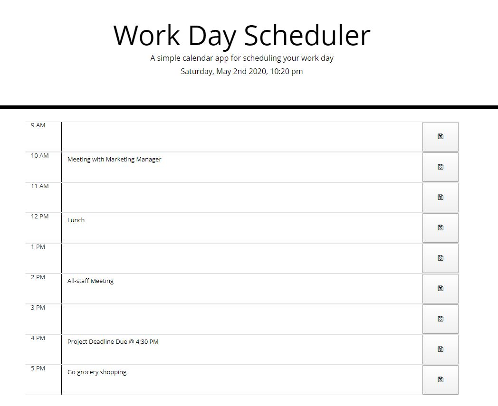

<h1>Work Day Scheduler</h1>
</ br>
</ br>
This week's assignment is the work day scheduler. This application includes JQuery, moment.js and Bootstrap. The scheduler will allow users to save events for each hour of the work day. When they type in an event, they will be able to click save. If they close out of their web browser or need to change details of their scheduled event, the application will remain saved when they go back to the page. 
 
 
https://vsomsouk.github.io/work-day-scheduler/
 
 

